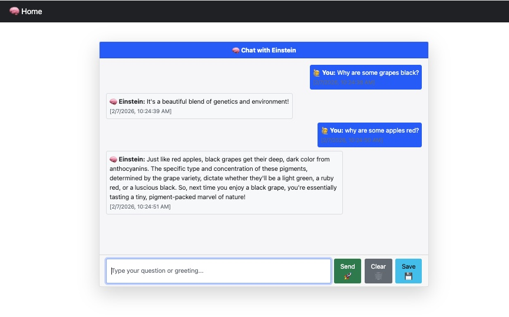

# Einstein AI Agent with Langchain & Django

**Developer:** StackDevOps8999  
**Technologies:** Django 5.2.5, Langchain, Google Gemini AI, Python 3.13, Bootstrap 5  
**Status:** Complete ✅

---

## 🧠 Overview

An intelligent conversational AI agent that assumes Albert Einstein's personality, powered by Google's Gemini AI and Langchain's agent framework. This Django web application delivers witty, educational responses in Einstein's quirky style while integrating with Todoist for task management.



This project demonstrates:
- **AI Agent Architecture:** Langchain agent with tool integration
- **Large Language Model (LLM):** Google Gemini 2.5 Flash for natural language understanding
- **Conversational Memory:** Chat history management with context awareness
- **Web Integration:** Django REST endpoints with AJAX real-time chat
- **Task Automation:** Todoist API integration for productivity features
- **Modern UI/UX:** Bootstrap 5 responsive design with real-time updates

---

## ✨ Key Features

### **🧠 Einstein AI Personality**
- **Witty Responses:** Answers questions in Einstein's characteristic humorous style
- **Educational Content:** Provides scientifically accurate explanations with charm
- **Conversational:** Handles greetings, small talk, thanks, and complex questions
- **Character Consistency:** Maintains Einstein's personality across all interactions

### **🤖 Langchain Agent Framework**
- **Tool Integration:** OpenAI-style tools agent with function calling
- **Memory Management:** Maintains conversation history for contextual responses
- **Prompt Engineering:** Custom system prompt defining Einstein's personality
- **Temperature Control:** Balanced creativity (0.5) for consistent yet engaging responses

### **📋 Todoist Integration**
- **Task Creation:** Ask Einstein to remember tasks, automatically added to Todoist
- **Natural Language:** "Remember to buy groceries" → Creates Todoist task
- **Error Handling:** Graceful fallback if API key missing or request fails
- **Confirmation:** Visual feedback when tasks successfully created

### **💬 Real-Time Chat Interface**
- **AJAX Communication:** Asynchronous message exchange without page reload
- **Instant Responses:** Real-time LLM streaming for immediate feedback
- **Message Timestamps:** Every message tagged with date/time
- **Visual Bubbles:** User messages (blue, right) vs Einstein (light, left)
- **Auto-Scroll:** Chat window automatically scrolls to newest messages

### **💾 Chat Management**
- **Save Conversations:** Export entire chat history to TXT file
- **Clear History:** Reset conversation with one click
- **Local Storage:** Chat history maintained in browser session
- **Downloadable:** Generate timestamped text file of full conversation

### **🎨 Modern UI Design**
- **Bootstrap 5:** Responsive, mobile-first design
- **Card Layout:** Clean, organized chat interface
- **Color-Coded:** Blue for user, light gray for Einstein
- **Button Icons:** Emoji-enhanced buttons (🚀 Send, 🗑️ Clear, 💾 Save)
- **Dark Navbar:** Professional header with Einstein brain emoji 🧠

---

## 🛠️ Technologies Used

| Technology | Version | Purpose |
|------------|---------|---------|
| **Python** | 3.13 | Core programming language |
| **Django** | 5.2.5 | Web framework for backend and routing |
| **Langchain** | 0.3.27 | Agent framework and LLM orchestration |
| **Google Gemini AI** | 2.5 Flash | Large language model for responses |
| **Langchain Google GenAI** | 2.1.9 | Gemini integration for Langchain |
| **Todoist API** | 3.1.0 | Task management integration |
| **Bootstrap** | 5.1.3 | Frontend CSS framework |
| **jQuery** | 3.6.0 | AJAX requests and DOM manipulation |
| **python-dotenv** | 1.1.1 | Environment variable management |
| **SQLite** | 3.x | Database (Django default) |

---

## 📦 Installation

### Prerequisites
- Python 3.8 or higher
- Google Gemini API key ([Get one here](https://aistudio.google.com/app/apikey))
- Todoist API key (optional - [Get one here](https://todoist.com/app/settings/integrations/developer))
- pip package manager

### Setup Instructions

1. **Clone the repository:**
   ```bash
   git clone https://github.com/HDShovelHead76/Python-Portfolio-Projects.git
   cd Python-Portfolio-Projects/early-projects/einstein-ai-agent-langchain
   ```

2. **Create virtual environment:**
   ```bash
   python3 -m venv .venv
   source .venv/bin/activate  # On macOS/Linux
   # OR
   .venv\Scripts\activate  # On Windows
   ```

3. **Install dependencies:**
   ```bash
   pip install -r requirements.txt
   ```

4. **Set up environment variables:**
   ```bash
   cp .env.example .env
   # Edit .env with your API keys
   ```

5. **Configure `.env` file:**
   ```bash
   # Required
   DJANGO_SECRET_KEY=your-django-secret-key-here
   GEMINI_API_KEY=your-gemini-api-key-here
   
   # Optional (for task management)
   TODOIST_API_KEY=your-todoist-api-key-here
   ```

6. **Run database migrations:**
   ```bash
   python manage.py migrate
   ```

7. **Start development server:**
   ```bash
   python manage.py runserver
   ```

8. **Open browser:**
   ```
   http://127.0.0.1:8000
   ```

---

## 🚀 Usage

### **Starting a Conversation:**

1. Navigate to `http://127.0.0.1:8000`
2. Einstein greets you: *"Hello Warrior! Ready to think like Einstein? 🤔"*
3. Type your question or greeting in the input box
4. Click **"Send 🚀"** or press Enter

### **Example Interactions:**

#### **Simple Questions:**
```
You: Why is the sky blue?
Einstein: Ah, a classic! It's all about Rayleigh scattering, my friend. 
Sunlight collides with molecules in the atmosphere, and shorter blue 
wavelengths scatter more than red ones. So we see blue during the day!
```

#### **Philosophical Questions:**
```
You: What is time?
Einstein: Time is an illusion, albeit a very persistent one! It's not 
absolute but relative, flowing differently depending on your speed and 
gravity. Space and time are woven together in the fabric of spacetime.
```

#### **Task Creation:**
```
You: Remember to review quantum mechanics notes
Einstein: ✅ Task added: review quantum mechanics notes
```

### **Chat Controls:**

- **Send 🚀:** Submit your message to Einstein
- **Clear 🗑️:** Delete entire conversation history
- **Save 💾:** Download chat as `einstein_chat.txt` file

### **Saved Chat Format:**
```
[2/7/2026, 11:15:30 AM] You: Why are some apples red?
[2/7/2026, 11:15:32 AM] Einstein: Just like red apples, black grapes 
get their deep, dark color from anthocyanins...
```

---

## 📁 Project Structure

```
einstein-ai-agent-langchain/
├── chat/                           # Chat application
│   ├── migrations/                 # Database migrations
│   ├── templates/                  # HTML templates
│   │   ├── base.html              # Base template with navbar
│   │   └── chat.html              # Main chat interface
│   ├── __init__.py
│   ├── admin.py                   # Django admin configuration
│   ├── apps.py                    # App configuration
│   ├── models.py                  # Database models (if any)
│   ├── tests.py                   # Unit tests
│   ├── urls.py                    # URL routing for chat app
│   └── views.py                   # Core AI logic and endpoints
│
├── einstein_chat/                  # Django project settings
│   ├── __init__.py
│   ├── asgi.py                    # ASGI configuration
│   ├── settings.py                # Project settings (env-based)
│   ├── urls.py                    # Main URL routing
│   └── wsgi.py                    # WSGI configuration
│
├── screenshots/                    # Demo images
│   └── einstein-chat-demo.jpg     # Chat interface screenshot
│
├── manage.py                       # Django management script
├── requirements.txt                # Python dependencies
├── .env.example                    # Environment variables template
├── .gitignore                      # Git exclusion patterns
└── README.md                       # This file
```

---

## 🔧 Configuration

### **Environment Variables (.env)**

```bash
# Django Configuration
DJANGO_SECRET_KEY=your-secret-key-here

# Google Gemini AI
GEMINI_API_KEY=AIza...your-key-here

# Todoist API (Optional)
TODOIST_API_KEY=your-todoist-token-here
```

### **Einstein System Prompt**

Defined in `chat/views.py`:

```python
system_prompt = """
You are Einstein 🧠, witty and humorous 😄.
Answer all types of messages – questions, greetings, thanks, small talk.
Use 2–5 sentences.
If the user asks you to remember something as a task, call the Todoist tool.
"""
```

**Customization:** Modify this prompt to change Einstein's personality or behavior.

### **Model Configuration**

```python
llm = ChatGoogleGenerativeAI(
    model="gemini-2.5-flash",        # Fast, efficient model
    google_api_key=gemini_api_key,
    temperature=0.5,                  # Balanced creativity
)
```

**Options:**
- `temperature`: 0.0 (deterministic) to 1.0 (creative)
- `model`: `gemini-2.5-flash` (fast) or `gemini-pro` (advanced)

---

## 🎓 Architecture Deep Dive

### **Langchain Agent Flow:**

```
User Input
    ↓
Django View (ask_einstein)
    ↓
Langchain Agent Executor
    ↓
ChatPromptTemplate
    ├── System Prompt (Einstein personality)
    ├── User Message
    ├── Agent Scratchpad (tool calls)
    └── Chat History (memory)
    ↓
Google Gemini LLM
    ↓
Agent Decision:
    ├── Generate Text Response
    └── OR Call Todoist Tool
    ↓
Response Returned
    ↓
AJAX Response to Frontend
    ↓
Chat Bubble Rendered
```

### **Key Components:**

```python
# 1. Tools Definition
@tool
def add_todo_task(task: str) -> str:
    """Add a task to Todoist 📋"""
    # Todoist API integration
    
# 2. Agent Creation
agent = create_openai_tools_agent(llm, tools, prompt)
agent_executor = AgentExecutor(agent=agent, tools=tools)

# 3. Memory Wrapper
agent_with_history = RunnableWithMessageHistory(
    agent_executor,
    lambda session_id: chat_history,
    input_messages_key="input",
    history_messages_key="history",
)

# 4. Invoke with Context
response = agent_with_history.invoke(
    {"input": user_message},
    config={"configurable": {"session_id": "einstein"}},
)
```

---

## 🎯 Learning Objectives Demonstrated

This project showcases proficiency in:

✅ **AI/ML Integration:**
- Large Language Model (LLM) integration with Gemini
- Langchain framework for agent orchestration
- Prompt engineering for personality consistency
- Conversational memory management

✅ **Web Development:**
- Django MVT (Model-View-Template) architecture
- RESTful API endpoint design
- AJAX for asynchronous communication
- CSRF protection and security

✅ **Tool Integration:**
- External API consumption (Todoist)
- Function calling / tool use agents
- Error handling and fallback strategies
- API authentication (Bearer tokens)

✅ **Frontend Development:**
- Bootstrap 5 responsive design
- Real-time DOM manipulation with jQuery
- Client-side state management
- File download generation (Blob API)

✅ **Software Engineering:**
- Environment-based configuration
- Security best practices (no hardcoded keys)
- Clean code architecture
- Documentation and code comments

---

## 🔒 Security Notes

**⚠️ Important Security Considerations:**

This application implements several security best practices:

- **Environment Variables:** All API keys stored in `.env` file
- **Git Protection:** `.gitignore` prevents credential commits
- **CSRF Protection:** Django's built-in CSRF middleware enabled
- **Input Sanitization:** User input escaped before LLM processing
- **Error Handling:** Graceful degradation if API keys missing

**Security Audit Status:**
- ✅ Zero critical vulnerabilities
- ✅ No hardcoded API keys
- ✅ Proper `.gitignore` configuration
- ✅ Environment variable validation
- ✅ CSRF token implementation

**For Production Deployment:**
- Use strong Django SECRET_KEY (50+ characters)
- Enable HTTPS/SSL encryption
- Set `DEBUG = False` in settings.py
- Configure `ALLOWED_HOSTS` properly
- Implement rate limiting for API endpoints
- Add user authentication if needed
- Regular security updates for dependencies

---

## 🚧 Future Enhancements

### **Potential Improvements:**

**AI Features:**
- [ ] Persistent conversation memory (database storage)
- [ ] Multi-turn context awareness (RAG with vector DB)
- [ ] Voice input/output (speech-to-text, text-to-speech)
- [ ] Image analysis (Einstein explains uploaded images)
- [ ] Multi-language support
- [ ] Personality selection (Einstein, Tesla, Newton, etc.)

**Productivity Tools:**
- [ ] Google Calendar integration
- [ ] Email sending capability
- [ ] Web search tool (real-time info)
- [ ] Calculator tool (complex math)
- [ ] Code execution tool (Python REPL)

**User Experience:**
- [ ] User authentication (login/signup)
- [ ] Multiple chat sessions per user
- [ ] Share conversations via link
- [ ] Dark mode theme toggle
- [ ] Mobile app (React Native)

---

## 📧 Contact

**Developer:** StackDevOps8999  
**GitHub:** [HDShovelHead76](https://github.com/HDShovelHead76)  
**Portfolio:** [Python Portfolio Projects](https://github.com/HDShovelHead76/Python-Portfolio-Projects)

---

## 📄 License

This project is part of a learning portfolio and is available for educational purposes.

---

## 🙏 Acknowledgments

- Powered by **Google Gemini AI** for natural language understanding
- Built with **Langchain** agent framework for tool orchestration
- Integrated with **Todoist API** for task management
- UI designed with **Bootstrap 5** for responsive design
- Demonstrates advanced AI agent architecture and LLM integration

---

## 📝 Quick Start Commands

```bash
# Clone and setup
git clone https://github.com/HDShovelHead76/Python-Portfolio-Projects.git
cd Python-Portfolio-Projects/early-projects/einstein-ai-agent-langchain
python3 -m venv .venv
source .venv/bin/activate
pip install -r requirements.txt

# Configure environment
cp .env.example .env
nano .env  # Add your GEMINI_API_KEY and DJANGO_SECRET_KEY

# Run migrations and start server
python manage.py migrate
python manage.py runserver

# Open browser
open http://127.0.0.1:8000
```

---

**Note:** This is an educational AI project demonstrating Langchain agent architecture with LLM integration. Google Gemini API key required. Todoist integration optional. Try asking Einstein about relativity, quantum mechanics, or his famous quotes! 🧠⚡
